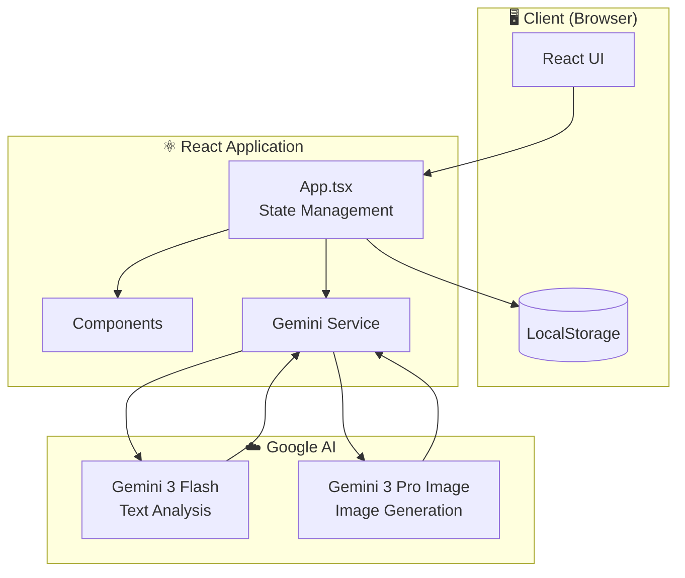
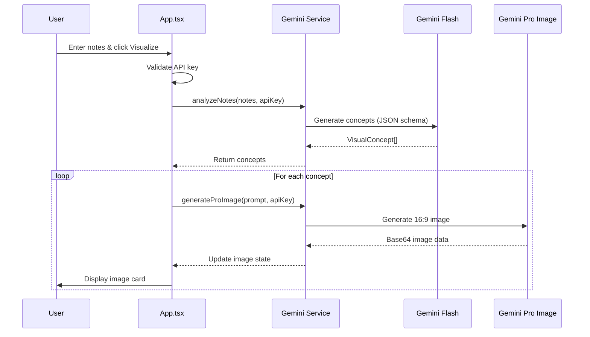
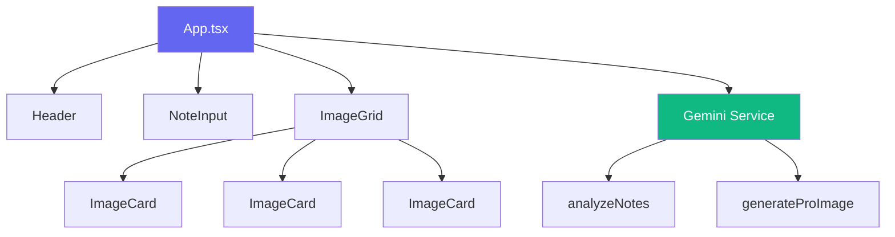
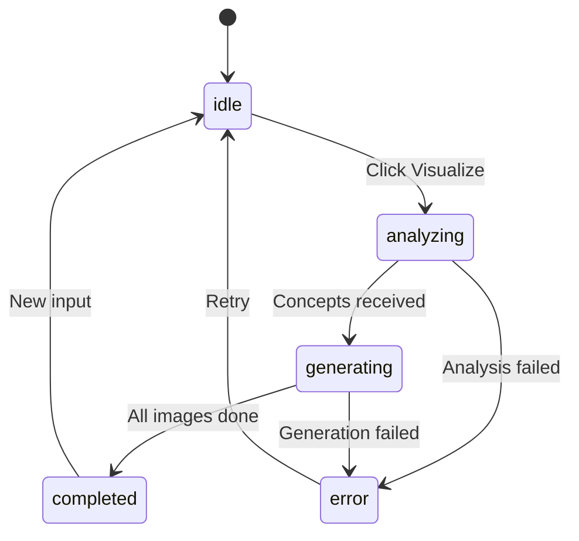

<div align="center">

# 📚 VisualNotes AI

**Transform your notes into stunning AI-generated visuals**

[](https://react.dev/)
[](https://www.typescriptlang.org/)
[](https://vitejs.dev/)
[](https://ai.google.dev/)

[Features](#features) • [Demo](#demo) • [Installation](#installation) • [Architecture](#architecture) • [Usage](#usage)

</div>

---

## ✨ Features

- 🧠 **AI-Powered Analysis** - Gemini 3 Flash analyzes your notes and extracts key visual concepts
- 🎨 **Pro Image Generation** - Gemini 3 Pro Image creates stunning, realistic 16:9 visuals
- 📱 **Responsive Design** - Beautiful UI that works on desktop and mobile
- 💾 **Download Images** - Save generated high-resolution images directly
- 🔐 **Secure Key Storage** - API keys stored locally in your browser

## 🎯 Demo

1. Enter your study notes or any text content
2. AI analyzes and identifies 3-10 key visual concepts
3. High-quality realistic images are generated for each concept
4. Download and use the visuals for learning or presentations

## 🚀 Installation

### Prerequisites

- Node.js 18+
- Gemini API Key ([Get one here](https://aistudio.google.com/apikey))

### Quick Start

```bash
# Clone the repository
git clone https://github.com/yourusername/visualnotes-ai.git
cd visualnotes-ai

# Install dependencies
npm install

# Start development server
npm run dev
```

Open http://localhost:3000 and enter your Gemini API key when prompted.

### Environment Variables (Optional)

Create a `.env.local` file to pre-configure your API key:

```env
VITE_GEMINI_API_KEY=your_api_key_here
```

## 🏗️ Architecture

### System Overview



### Data Flow



### Component Structure



### State Machine



## 📁 Project Structure

```
visualnotes-ai/
├── components/
│   ├── Header.tsx        # App header with branding
│   ├── NoteInput.tsx     # Text input for notes
│   ├── ImageGrid.tsx     # Grid layout for images
│   └── ImageCard.tsx     # Individual image display
├── services/
│   └── gemini.ts         # Gemini API integration
├── App.tsx               # Main application component
├── types.ts              # TypeScript interfaces
├── index.tsx             # Entry point
└── index.html            # HTML template
```

## 🔧 Tech Stack

| Technology | Purpose |
|------------|---------|
| React 19 | UI Framework |
| TypeScript | Type Safety |
| Vite | Build Tool |
| Tailwind CSS | Styling |
| Lucide React | Icons |
| Google GenAI SDK | AI Integration |

## 📝 API Reference

### Types

```typescript
interface VisualConcept {
  id: number;
  title: string;
  description: string;
  imagePrompt: string;
}

interface GeneratedImage {
  id: number;
  base64?: string;
  loading: boolean;
  error?: string;
}

type AppStatus = 'idle' | 'analyzing' | 'generating' | 'completed' | 'error';
```

### Services

```typescript
// Analyze notes and extract visual concepts
analyzeNotes(notes: string, apiKey: string): Promise<VisualConcept[]>

// Generate a high-quality image from a prompt
generateProImage(prompt: string, apiKey: string): Promise<string>
```

## 🤝 Contributing

Contributions are welcome! Please feel free to submit a Pull Request.

## 📄 License

MIT License - feel free to use this project for learning and personal projects.

---

<div align="center">

**Built with ❤️ using React and Gemini AI**

</div>
